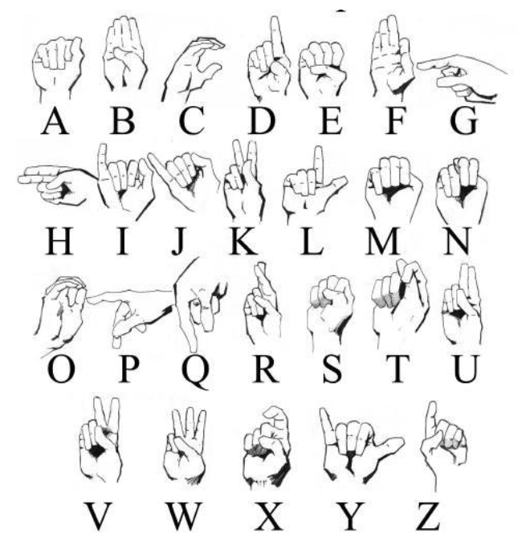
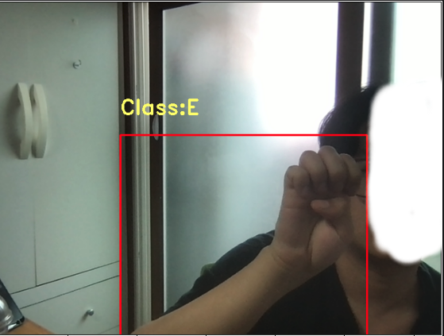

# 🔥 Sign Language Alphabet Detection

|  | 
|:--:| 
| *[Researchgate](https://www.researchgate.net/figure/American-Sign-Language-alphabet_fig1_340721626)* |

# Contents

1. **Project Description**
2. **Project Goals**
3. **Project Walkthrough**
3. **Achievements**
4. **Lessons learned**

# Project Description

Sign language is the essential way for those who are deaf or hard of hearing. Sign language enables deaf people to communicate with each other without voices. However, many people have never learned sign language before.

The project focuses on **detecting sign language alphabets** (a, b, c, d, e) using `YOLOv2`.

# Project Goals

The ultimate goal of this project is to **experience the whole object detection pipeline and implement everything from sratch**. Below are the details.

1. Experience **end-to-end** deep learning project pipeline.

2. **Implement everything from scratch without using library** including YOLOv2 model, loss function, object detection related utils, metrics, etc.

3. Build **custom datasets** using annotation tool.

4. Manage projects with **git** using various functionalities such as issue templates, commit templates, pull request, etc.

# Project Walkthrough

> 1. Read **YOLOv2** paper [link](https://arxiv.org/abs/1612.08242) and implement it

This was the hardest part in the project. Implementing darknet19 and YOLOv2 were quite simple but the **loss function** was very complicated. I ended up referencing the loss function flow but implemented other things from scratch. It was a very helpful experience.
    
    
> 2. Generate Custom Dataset

I constructed **51 samples** for each label (a-e) using `OpenCV` and webcam.

`create_dataset.py` implements **automatic screenshot at every 4 seconds** using webcam.

Then, I used [labelImg](https://github.com/tzutalin/labelImg#:~:text=LabelImg%20is%20a%20graphical%20image%20annotation%20tool.,the%20format%20used%20by%20ImageNet.) annotation tool to annotate bounding boxes in **YOLO** format.

Among 255 samples, 40 (8 each) were used for validation set. 

> 3. Implement metrics

Metrics are essential in evaluating the performance on the datasets. It was helpful experience to implement **mAP**, **IoU**, **NMS** using vectorizations and matrix multiplications.

> 4. Implement the traning pipeline

Now we have the model, loss function, metrics, and datasets. It's time to train!

> 5. Train & Inference

The model was trained for 300-500 epochs and tested.

# Achievements

I think object detection task is particularly complicated especially for anchor-based networks. It would be much easier to just use nice YOLO library but I wanted to have at least one experience to build everything from scratch with the least references.

I learned tons of things through implementing the model, gathering custom data, annotating them and training the model, especially working with various pytorch and numpy operations and getting comfortable with the high-dimension matrix multiplications, reshaping, etc.

However, the final performance was bad. The **mAP** for training dataset was only `10~15%` and worse for the validation set. I suspected two reasons:

1. Made some mistakes for the loss function or utils. If one line of codes is mistaken, the whole logic breaks apart. I spent much time on debugging but haven't found one myself yet.

2. Insufficient data samples. I used total of `255 ` samples only due to the limited time and also because I thought detecting only 5 labels would not be complicated (also there's one target per image). It might work for much easier tasks such as image classification, but I suspect that object detection task is much more complicated, requiring much more data samples. However, I first thought that the **training set** must be at least **overfitting** but the performance was bad in the training set, not only the validation set. I'll keep debugging and trying other methods to make achieve a decent performance.

Even though the result was not so good, it was a definitely tremendously helpful project! I'll later have to compare my model with the sophisticated library for an ablation study. If it works, I'll find the error. If not, i'll gather more data samples :)

# Lessons Learned

Maybe it's not absolutely necessary but I've always wanted to be **really good at coding**. I read many papers and articles everyday but implementing everything from scratch still looked far away..

I personally believe the actual understanding only comes from implementing it. 

It was painful but super helpful!

This was a small size toy project but I'll keep working hard to move on to some cool projects soon enough!

